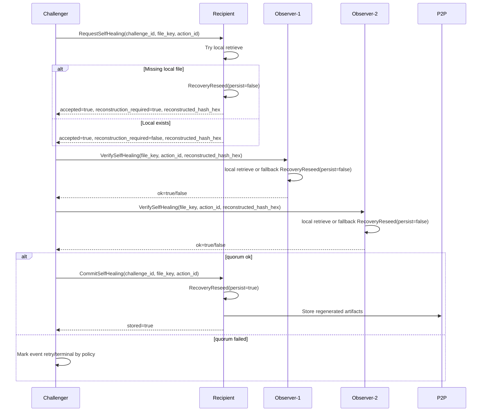
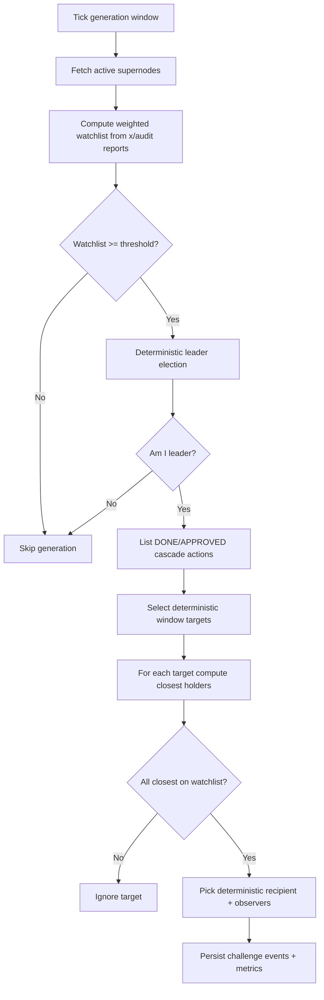

# Self-Healing (Cascade) - Design and Implementation

## Scope

This implementation covers **off-chain self-healing for CASCADE actions** in the new Lumera supernode architecture.

Out of scope for this phase:

- NFT self-healing
- Sense self-healing
- On-chain capability/module changes for phase-4 protocol governance

## High-Level Goal

Recover missing cascade artifacts deterministically and safely:

1. Trigger only when watchlist conditions are met from weighted multi-reporter audit view.
2. Generate deterministic challenges once per window.
3. Reconstruct missing file content.
4. Verify reconstructed hash through observer quorum.
5. Persist regenerated artifacts to P2P **only after observer quorum succeeds**.

## Components

- `supernode/self_healing/service.go`
  - Trigger, generation, deterministic selection, event processing, quorum, commit orchestration.
- `supernode/transport/grpc/self_healing/handler.go`
  - Recipient/observer RPC handlers:
    - `RequestSelfHealing`
    - `VerifySelfHealing`
    - `CommitSelfHealing`
- `supernode/cascade/reseed.go`
  - Recovery reseed primitive used by self-healing:
    - reconstruct/hash without persist (`PersistArtifacts=false`)
    - reconstruct + persist (`PersistArtifacts=true`)
- `pkg/storage/queries/self_healing.go`
  - Event queue persistence, lease claim/reclaim, retry/terminal lifecycle.

## Triggering and Watchlist Decision

Self-healing generation is triggered only when weighted watchlist threshold is met:

1. Active supernodes are discovered.
2. For each active target node, challenger reads `x/audit` storage challenge reports.
3. Reports are deduplicated by reporter and interpreted against required-open-port policy.
4. Node enters weighted watchlist when closed-report percentage exceeds threshold and quorum reporters are present.
5. If `len(watchlist) < WatchlistThreshold`, generation is skipped.

This prevents single-node/local-opinion triggering and aligns with multi-reporter policy.

## Deterministic Generation Model

### Deterministic leader per window

For each generation window:

- `windowID = now.Truncate(GenerationInterval).Unix()`
- Leader elected from active set using deterministic hash scoring over `(windowID, watchHash, nodeID)`.

Only elected leader generates events.

### Candidate targets

Leader lists cascade actions from chain (`DONE` and `APPROVED` states), extracts anchor file key from metadata, and optionally caps per window by `MaxChallenges`.

### File needs healing when

For each target key:

- determine deterministic closest holder set
- if **all closest holders are on watchlist**, target is marked for self-healing

### Recipient and observers

From online, active, non-watchlist nodes (excluding self):

- recipient = deterministic pick over `fileKey`
- observers = deterministic top-N over remaining eligible pool

### Challenge ID

Challenge ID is deterministic per generation window and action (`deriveWindowChallengeID`).

## Event Persistence and Dedup

Each node uses local SQLite (node-local DB, not shared).

Key guarantees:

- Unique event key on `(trigger_id, ticket_id, challenge_id)` avoids duplicate inserts.
- Processing uses lease-claim semantics:
  - statuses: `pending -> processing -> completed/retry/terminal`
  - lease owner + expiry for restart-safe reclaim
- Retry uses exponential backoff and max attempts.

## Request / Verify / Commit Flow

### Core behavior

1. Challenger sends `RequestSelfHealing`.
2. Recipient:
   - tries local retrieve
   - if missing, reconstructs and returns `reconstructed_hash_hex` **without storing artifacts**.
3. Challenger asks observers to `VerifySelfHealing`.
4. Observer:
   - tries local retrieve first
   - if missing, reconstructs in fallback mode **without storing artifacts**
   - compares computed hash with recipient hash
5. If quorum passes, challenger sends `CommitSelfHealing`.
6. Recipient runs persist mode and stores regenerated artifacts into P2P.

This is the critical policy change: **store after quorum approval**.

## Reconstruction Modes (RecoveryReseed)

`RecoveryReseedRequest` now has `PersistArtifacts *bool`:

- `false`: decode + integrity verify + hash only
- `true`: decode + integrity verify + re-encode + RQ metadata regen + store artifacts
- `nil`: defaults to persist (backward-compatible behavior for existing recovery-admin path)

`RecoveryReseedResult` includes `ReconstructedHashHex` for both modes.

## Observer Fallback (No Local Copy)

In `VerifySelfHealing`:

1. Try local retrieve (`localOnly=true`).
2. If not found, resolve action (`action_id` if provided, else by file-key index).
3. Run fallback reconstruction (`PersistArtifacts=false`).
4. Compare fallback hash with `reconstructed_hash_hex` from recipient.
5. Return `ok=true/false`.

No artifact persistence is performed in observer fallback.

## RPC Contracts

### Request

- `RequestSelfHealingRequest` includes `action_id` (optional but preferred).

### Verify

- `VerifySelfHealingRequest` includes `action_id` (optional but preferred).

### Commit

- New `CommitSelfHealing(CommitSelfHealingRequest)`.
- Called only after observer quorum success.
- Persists regenerated artifacts on recipient.

## Sequence Diagram (Happy Path)

## Sequence Diagram (Generation)

## Hash Integrity and E2E Assertions

Self-healing reconstructed hash is checked against action metadata hash:

- action metadata `DataHash` is canonical registered file hash (base64)
- reconstructed hash is compared in observers and E2E tests

System happy-path test now asserts:

1. request returns reconstructed hash
2. reconstructed hash equals registered action hash
3. observer verify returns `ok=true`
4. commit returns `stored=true`

## Failure Semantics

Terminal/non-retry examples:

- stale window/epoch
- invalid payload

Retry examples:

- transient RPC/connectivity failure
- observer quorum failure
- commit/store failure

Retry policy uses bounded exponential backoff and max attempts.

## Performance and Scaling Notes

Current controls:

- bounded generation cap per window (`MaxChallenges`)
- bounded claim batch and worker pool (`MaxEventsPerTick`, `EventWorkers`)
- deterministic assignment avoids storms
- local cache for action target listing (`ActionTargetsTTL`)

Practical behavior for large volumes:

- generation remains window-capped
- processing remains lease-coordinated and worker-bounded
- duplicate deliveries collapse via unique event keys and idempotent metrics inserts

## Why `action_id` is carried in RPCs

`action_id` reduces ambiguity and chain scans during request/verify/commit:

- direct action resolution when provided
- fallback to file-key index only when absent

This improves correctness and reduces expensive lookup paths.

